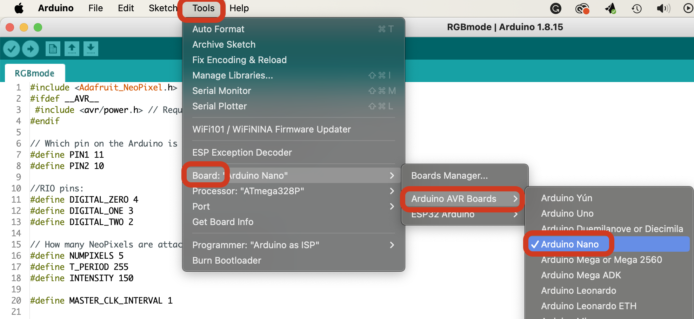
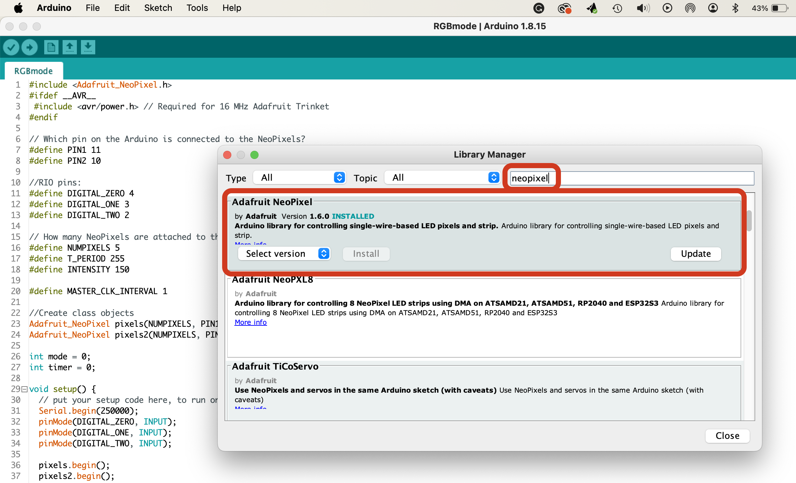

# roboClimberRGB

## Overview
This code controls four light bars mounted on my highschool FRC team's (1732 Hilltoppers) competition robot.
At the system's heart is an ATMEGA328p (Arduino Nano). WS2812B LED strips were soldered together in four chains of five.

Control commands came from the robot RoboRIO digital IO pins (DIO 0, 1, and 2 + GND). Three pins were used for a total of 8 (2^3) different lighting sequences.

## Initial Setup
1. Arduino IDE (https://www.arduino.cc/en/software)
2. Double-click on the RGBMode.ino file (inside the RGBMode folder) to open it in the Arduino IDE.

## Lighting Sequences
| Command |                      Description                      |                                                   Reasoning                                                 |
| ------- | ----------------------------------------------------- | ----------------------------------------------------------------------------------------------------------- |
| 0       | ${\textsf{Lights Off}}$                               | These RGB lights are bright, power-hungry, and run hot. When nothing is going on, turn them off.            |
| 1       | ${\textsf{\color{royalblue}Slow Blink Blue}}$         | An alert to the drive team that we are A) In Autonomous Mode. B) The robot has picked up 1 ball.            |
| 2       | ${\textsf{\color{goldenrod}Slow Blink Yellow}}$       | An alert to the drive team that we are A) In Autonomous Mode. B) The robot has picked up 2 balls.           |
| 3       | ${\textsf{\color{blue}Solid Blue}}$                   | An alert to the drive team that we are A) In TeleOp Mode. B) The robot has picked up 1 ball.                |
| 4       | ${\textsf{\color{yellow}Solid Yellow}}$               | An alert to the drive team that we are A) In TeleOp Mode. B) The robot has picked up 2 balls.               |
| 5       | ${\textsf{\color{red}Solid Red}}$                     | The robot is autonomously aligning to shoot a ball and spinning up the shooter flywheel. Don't Touch!       |
| 6       | ${\textsf{\color{forestgreen}Fast Blink Green}}$      | The robot is aligned and autonomously shooting. Don't Touch!                                                |
| 7       | ${\textsf{\color{purple}HILLTOPPER PARTY MODE}}$      | When the robot is idle, run a breathing animation that switches between blue and gold (our school colors).  |

## Compiling Code for the Arduino Nano
1. **Important** - Configure for the board. From the Menu, select Tools / Board: / Arduino AVR Boards / Arduino Nano

2. Load Adafruit's NeoPixel Library (if you haven't already) - From the Menu, select Sketch / Include Library / Manage Libraries...  Search for "neopixel" and install the Adafruit NeoPixel library.

4. You can test if the sketch compiles by clicking the check mark button in the upper left corner of the IDE.

## Flashing Code for the Arduino Nano
1. Make sure you have the right board selected: Tools / Board: / Arduino AVR Boards / Arduino Nano
2. Select the correct COM/Serial port. You can configure this by selecting: Tools / Port / *this part will be different, but should either start with /tty or COM followed by a number*
3. To flash, make sure your board is selected and connected, then click the arrow button in the upper left corner of the IDE.
4. If issues arise when flashing, check out the Arduino Docs: https://docs.arduino.cc/. They have great resources and tutorials for flashing to every board on the front page (as of Oct. 2023)!
5. Also, the cable you use oftentimes is the issue when flashing. Make sure the USB cable isn't just a power cable!!

## Coding in Arduino/C
Arduino .ino files are based on a simplified version of C (though you can still add external C/C++ libraries using #include). It is fairly similar to Java (yay curly brackets!), but memory management is very different.  Also, memory (RAM) on the Arduino is extremely limited (you only have 2kB). When in doubt, copy/paste, then modify existing code or look at the Arduino Docs: https://docs.arduino.cc/.
